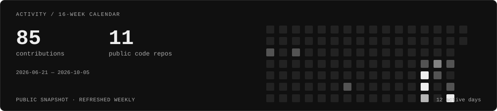

<picture>
  <source media="(prefers-reduced-motion: reduce) and (max-width: 600px)" srcset="profile-banner-mobile-still.svg">
  <source media="(prefers-reduced-motion: reduce)" srcset="profile-banner-still.svg">
  <source media="(max-width: 600px)" srcset="profile-banner-mobile.svg">
  
</picture>

  <a href="#selected-work">Selected work</a> &nbsp; / &nbsp;
  <a href="#toolkit">Toolkit</a> &nbsp; / &nbsp;
  <a href="#activity">Activity</a> &nbsp; / &nbsp;
  <a href="mailto:shakh090909@gmail.com">Email</a> &nbsp; / &nbsp;
  <a href="https://www.linkedin.com/in/shakhnazar-akhmer-43791a400/">LinkedIn ↗</a>

I build **computer vision systems, AI workflows, and mobile & web applications** — from an idea to a working prototype. Co-founder at **AEDEXA**, developer in **QwertyS**, based in Astana.

## Selected work

| Project | What I'm building |
| :--- | :--- |
| **[01 / Synapse](https://github.com/Eye172/synapse-app-v1)** MOBILE · COMPUTER VISION | Android exercise analysis with pose tracking, movement metrics and optional IMU input. React Native · Kotlin · MediaPipe |
| **[02 / CampusLense](https://github.com/Eye172/locus-hackathon-1)** WEB · DISCOVERY | University exploration with 3D maps, photo relevance checks and source provenance. React · FastAPI · 3D Maps |
| **[03 / AEDEXA](https://github.com/pip00sya/aedexa-hackathon)** 3D · ARCHITECTURE | Drawing-to-3D reconstruction and a browser workspace for site planning. Python · TypeScript · Three.js |
| **[04 / AgroFly](https://github.com/Eye172/ai-crop-field-analysis)** ML · AGRICULTURE | Multispectral crop classification and field-map inference with a six-channel ResNet18. Python · PyTorch · OpenCV |

1st place — LOCUS Startup Hackathon 2026 · HTML Challenge 2026

<b>Project context, roles & more work</b>

**Synapse · 2026–present.** Android application development and native camera integrations. A team prototype combining camera-based pose tracking with optional IMU input.

**CampusLense · September 2026.** Co-developed with [Nurkhan Aimukatov](https://github.com/pip00sya) in QwertyS. **1st place, LOCUS Startup Hackathon 2026.** [Live app ↗](https://nnurkhan91--campuslense-web.modal.run)

**AEDEXA · 2026–present.** Co-founder and developer with Nurkhan Aimukatov. **1st place, HTML Challenge 2026.**

**AgroFly · 2026.** I lead software and ML; **Bauyrzhan Nurali** develops the drone. A research prototype; data and independent field validation are being reassessed. [Concept website ↗](https://agrofly-website-1.vercel.app)

**[QApp](https://github.com/Eye172/qapp_hackathon_smart_university_profile_v1)** — Admissions matching, university profiles, documents and deadlines. Next.js / Prisma. Team lead and principal software developer.

**[inVisionU](https://github.com/Eye172/decentrathon5-project-v2)** — Applications, voice interviews and human-reviewed AI assessments. React / FastAPI. Co-developed in QwertyS for Decentrathon 5.0.

**[ThetaDesk](https://github.com/pip00sya/theta-desk)** — Paper-trading agents, deterministic risk gates and replayable decisions. Python / Streamlit. QwertyS team project.

**[Halyk AI Agent](https://github.com/pip00sya/Halyk-ai-agent)** — Document evidence, version resolution and checked financial calculations. QwertyS team project.

**Earlier work · 2022–2023:** [Telegram bots](https://github.com/Eye172/old-project-telegram-bots-2022), [audio player](https://github.com/Eye172/old-project-python-audioplayer-2022), [MechSolver](https://github.com/Eye172/old-project-mechsolver-telegram-bot), [Pygame](https://github.com/Eye172/old-project-pygame-2023), [Voithos](https://github.com/Eye172/old-project-fizmat-it-challenge-2023-voithos). Upload dates may differ from development dates.

**Additional recognition · 2026:** 1st, Impact EdTech Hackathon; 2nd, Impact Admissions × QIntern Hackathon.

## Toolkit

**Languages** &nbsp; `Python` `TypeScript` `Kotlin` `C#` 
**ML & AI** &nbsp; `PyTorch` `OpenCV` `Transformers` `LangGraph` 
**Applications** &nbsp; `React` `Next.js` `FastAPI` `React Native` `Expo` `Three.js`

## Activity

<a href="https://github.com/Eye172?tab=repositories">
  <picture>
    <source media="(max-width: 600px) and (prefers-color-scheme: light)" srcset="activity-mobile-light.svg">
    <source media="(max-width: 600px)" srcset="activity-mobile-dark.svg">
    <source media="(prefers-color-scheme: light)" srcset="activity-light.svg">
    
  </picture>
</a>

Repository count excludes forks, empty repositories and this profile. [Browse public code ↗](https://github.com/Eye172?tab=repositories) · [View without animation](profile-banner-still.svg)
