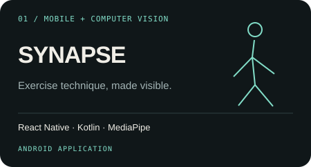
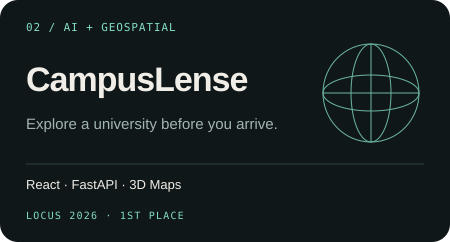
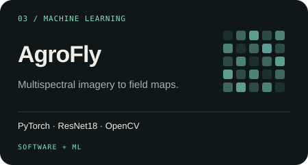
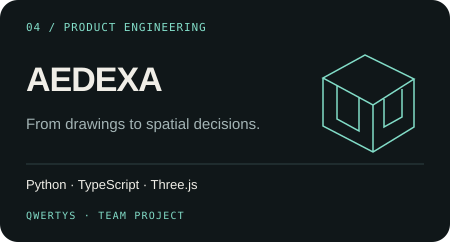
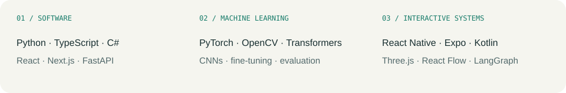
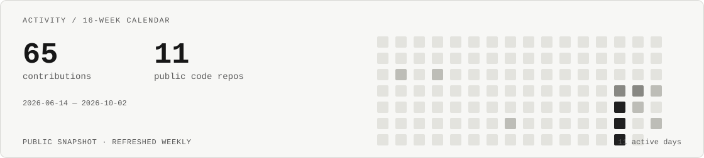

<picture>
  <source media="(prefers-color-scheme: dark)" srcset="header-dark.svg">
  
</picture>

  <a href="mailto:shakh090909@gmail.com">Email</a> &nbsp; / &nbsp;
  <a href="https://www.linkedin.com/in/shakhnazar-akhmer-43791a400/">LinkedIn</a> &nbsp; / &nbsp;
  <a href="https://github.com/Eye172?tab=repositories">Repositories</a>

I develop applications, ML models and AI workflows — from requirements and architecture through implementation, evaluation and debugging. My work spans computer vision, interactive web products and mobile systems.

**AEDEXA co-founder · QwertyS developer · Based in Astana, Kazakhstan.**

I collaborate with **[Nurkhan Aimukatov](https://github.com/pip00sya)** in **QwertyS** on engineering products and hackathon submissions. My earlier work includes Python applications and Unity/C# games; my current projects connect models, data and usable interfaces.

### Selected work

<table>
<tr>
<td width="50%" valign="top">

Android training flow with camera pose tracking, movement metrics and an optional IMU rig. I develop the application and its native camera integrations.

<a href="https://github.com/Eye172/synapse-app-v1">Explore the code →</a>
</td>
<td width="50%" valign="top">

University exploration with 3D maps, photo relevance checks and source provenance. Co-developed with Nurkhan in QwertyS.

<a href="https://github.com/Eye172/locus-hackathon-1">Code & demo →</a>
</td>
</tr>
<tr>
<td width="50%" valign="top">

Six-channel ResNet18 experiments and field-map inference. I lead software and ML; Bauyrzhan Nurali develops the drone. Currently reassessing data and field validation.

<a href="https://github.com/Eye172/ai-crop-field-analysis">Models & results →</a> · <a href="https://agrofly-website-1.vercel.app">Concept website</a>
</td>
<td width="50%" valign="top">

Drawing-to-3D reconstruction and a browser workspace for site planning. Co-founder and developer with Nurkhan; first place at HTML Challenge 2026.

<a href="https://github.com/pip00sya/aedexa-hackathon">Team repository →</a>
</td>
</tr>
</table>

### Engineering toolkit

<picture>
  <source media="(prefers-color-scheme: dark)" srcset="stack-dark.svg">
  
</picture>

**Across projects:** API integrations, data modelling, SSE streaming, deterministic validation around LLMs, model fine-tuning and evaluation, test scenarios and debugging. I document architecture, implementation boundaries and measured results so the engineering decisions can be reviewed.

### More to explore

| Project | Engineering focus | Collaboration |
| :--- | :--- | :--- |
| [QApp](https://github.com/Eye172/qapp_hackathon_smart_university_profile_v1) | Admissions matching, university profiles, documents and deadlines · Next.js / Prisma | Team lead & principal software developer |
| [inVisionU](https://github.com/Eye172/decentrathon5-project-v2) | Structured applications, voice interviews and human-reviewed AI assessments · React / FastAPI | QwertyS with [Nurkhan](https://github.com/pip00sya) |
| [ThetaDesk](https://github.com/pip00sya/theta-desk) | Paper-trading agents, deterministic risk gates and replayable decisions · Python / Streamlit | QwertyS |
| [Halyk AI Agent](https://github.com/pip00sya/Halyk-ai-agent) | Document evidence, version resolution and checked financial calculations | QwertyS |

**Selected recognition · 2026**  
1st — LOCUS Startup Hackathon · HTML Challenge · Impact EdTech Hackathon  
2nd — Impact Admissions × QIntern Hackathon

Earlier projects · 2022–2023

Python foundations: [Telegram bots](https://github.com/Eye172/old-project-telegram-bots-2022), [audio player](https://github.com/Eye172/old-project-python-audioplayer-2022), [MechSolver](https://github.com/Eye172/old-project-mechsolver-telegram-bot), [Pygame](https://github.com/Eye172/old-project-pygame-2023) and [Voithos](https://github.com/Eye172/old-project-fizmat-it-challenge-2023-voithos). Preserved as earlier work; repository upload dates differ from development dates.

 
<picture>
  <source media="(prefers-color-scheme: dark)" srcset="activity-dark.svg">
  
</picture>

Open the project READMEs for architecture, implementation status, setup and evaluation details.

